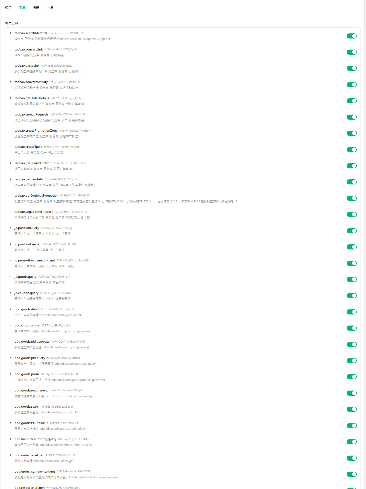

# 淘宝客 MCP 服务

[](https://smithery.ai/server/@liuliang520530/taoke-mcp)

淘宝联盟，京东联盟，多多进定全平台 MCP 服务是一个基于 Model Context Protocol (MCP) 的服务，支持淘宝、京东、拼多多三大电商平台的链接转换和商品推广功能，商品搜索等等一系列工具

# github:

https://github.com/liuliang520530/taoke-mcp/

## 视频教程

https://www.bilibili.com/video/BV1QZ1jB2ENk


## smithery服务托管
https://smithery.ai/server/@liuliang520530/taoke-mcp

## 支持docker部署
https://hub.docker.com/r/liuliang520500/taoke-mcp

```shell
docker run -dit \
--name taoke-mcp  \
--restart always \
-p 8081:8081 \
-e ENV_URL=https://config.sinataoke.cn/api/mcp/secret \
-e ENV_SECRET=url:mcp.sinataoke.cn \
-e ENV_OVERRIDE=false \
liuliang520500/taoke-mcp


你可以添加更多的环境变量 -e，参考下面的stdio配置

```

## 官方文档

https://mcp.sinataoke.cn/docs

## 在 Cherry Studio 上的工具展示



## 交流群，扫码入群


# 使用方法

### 环境变量配置

服务需要配置以下环境变量：

```
# 环境变量加载配置
ENV_URL=https://config.sinataoke.cn/api/mcp/secret
ENV_SECRET=url:mcp.sinataoke.cn
ENV_OVERRIDE=false  # 可选，是否覆盖当前已存在的环境变量，这个一定要为false，不然下面的配置将不生效

# 淘宝客API配置
TAOBAO_PID=your-pid # 淘宝联盟PID
TAOBAO_SESSION=your-session # 你的授权ID，下面有授权链接

# 京东联盟API配置
JD_KEY=your-jd-key # union.jd.com后台获取的
JD_PID=your-pid-id # PID的第一段

# 拼多多API配置
PDD_PID=your-pid # jinbao.pinduoduo.com上获取的，需要授权
PDD_SESSION_TOKEN=your-session-token # 授权token，授权链接在下面
```

# 淘宝联盟授权链接：

https://oauth.taobao.com/authorize?response_type=token&client_id=34297717&state=1212&view=web

# 拼多多授权链接

https://jinbao.pinduoduo.com/open.html?client_id=313cc43a30cf487da0a336d9f2df7de2&response_type=code&redirect_uri=http%3A%2F%2Fddk.mintaoke.cn%2FApi%2Fget_access_token&view=web

# 拼多多 PID 授权

-   授权链接用工具 pdd.goods.prom.url 转一个推广链接，参数 generate_authority_url=true，如果没授权，会优先走授权链接
-   你如果让 ai 通过 MCP 授权的话，你就直接发送一个商品链接，并告诉 ai 参数 generate_authority_url=true，然后 ai 就会通过当前工具授权链接用工具 pdd.goods.prom.url 转一个推广链接，并返回一个授权链接给你

# 与 Claude Desktop 或 Cherry Studio 集成

要在 Claude Desktop 中使用此服务

### 使用 MCP 配置文件

您也可以使用 MCP 配置文件来启动服务。创建一个名为 `mcp.json` 的文件，内容如下【stdio配置】：

```json
{
	"mcpServers": {
		"taobao-mcp": {
			"name": "导购助手",
			"type": "stdio",
			"isActive": true,
			"command": "npx",
			"args": [
				"-y",
				"@liuliang520500/sinataoke_cn@latest",
				"g:win11desktop/logs/" // 可选，日志文件夹路径,，如果要填写，要换成你自己本地电脑上的一个文件夹
			],
			"env": {
				"ENV_URL": "https://config.sinataoke.cn/api/mcp/secret",
				"ENV_SECRET": "url:mcp.sinataoke.cn",
				"ENV_OVERRIDE": "false",
				"TAOBAO_PID": "淘宝PID",
				"TAOBAO_SESSION": "淘宝授权token，上面有授权链接，授权后，复制token到这里",
				"JD_KEY": "union.jd.com上去取",
				"JD_PID": "union.jd.com上去取",
				"PDD_PID": "拼多多PID",
				"PDD_SESSION_TOKEN": "拼多多授权token，上面有授权链接"
			}
		}
	}
}
```

## 支持的功能

### 淘宝平台

-   链接转换
-   链接解析
-   活动转换
-   订单详情查询
-   工具列表
-   推广请求
-   创建推广位
-   淘口令创建
-   物料搜索
-   处罚订单查询
-   商品信息查询
-   优选推广

### 京东平台

-   推广位查询
-   推广位创建
-   联盟推广
-   商品查询
-   优惠券查询

### 拼多多平台

-   商品详情
-   CMS 推广链接
-   推广位生成
-   推广位查询
-   推广链接生成
-   商品推荐
-   商品搜索
-   多多进宝转链
-   会员权限查询
-   订单详情查询
-   订单增量查询
-   推广位生成

## 许可证

ISC

## 作者 VX

-   liuliangzheng

### 有任务使用问题联系作者，请认准包名：

-   @liuliang520500/sinataoke_cn@latest 谨防假冒
